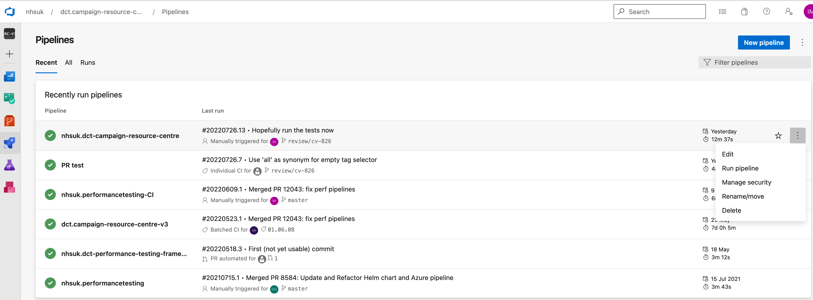
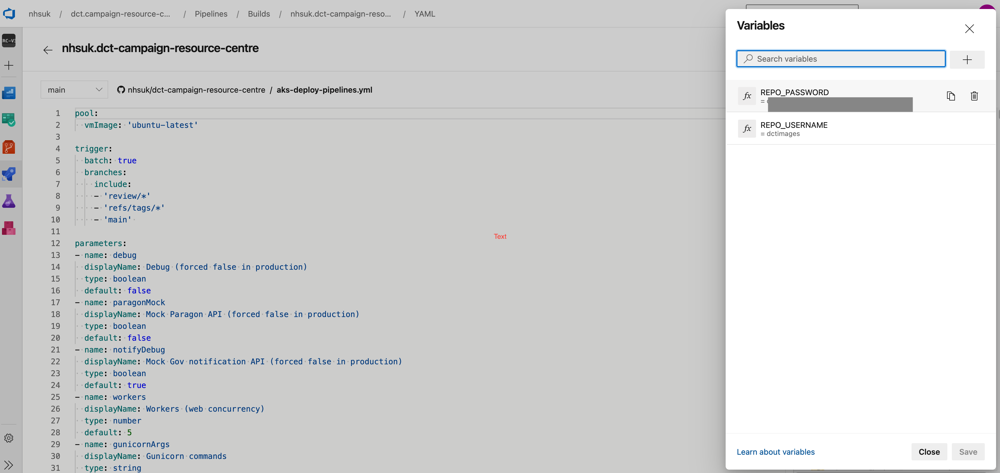

# Campaign Resource Centre Wagtail site

## Introduction

The campaign resource centre (CRC) is a government site responsible for providing resources associated with various NHS digital campaigns as well as "how to guides" to assist users planning their own marketing campaigns.

The live site can be found here:  
https://campaignresources.dhsc.gov.uk/

Online documentation for CRC can be accessed on Confluence (using your nhs.net email address) and a couple of helpful links are provided below.

Current version 'homepage':  
https://digitaltools.phe.org.uk/confluence/display/CRC/CRC+V3

Development related documentation:  
https://digitaltools.phe.org.uk/confluence/display/CRC/Dev+CRC+V3

## Table of Contents

<!-- vim-markdown-toc GitLab -->

* [Architecture](#architecture)
* [Running the project](#running-the-site)
* [Testing](#testing)
* [Versioning](#versioning)
* [Development processes](#development-processes)
* [Pipelines](#pipelines)

<!-- vim-markdown-toc -->

## Architecture

CRC operates using three servers:
1. Web application server:  
    * Python/ Django/ Wagtail
    * Most of this repo is devoted to this
2. Redis server:  
    * Used for caching
3. Database server (Postgres):  
    * Stores most of the persistent application data

The remaining persistent data fall into two categories:
1. File resources
    * Images, pdfs, videos, zip archives
    * Uploaded by content editors
2. Index entries
    * Each page or resource created needs an index entry which is a small JSON document
   used by the Azure search indexer

For further details, diagrams and external dependencies see the designated pages in Confluence:

https://digitaltools.phe.org.uk/confluence/display/CRC/Development+vs+Production+Architecture

#### Diagrams:
https://digitaltools.phe.org.uk/confluence/display/CRC/Technical+Architecture+Diagram  
https://digitaltools.phe.org.uk/confluence/display/CRC/Monitoring  
https://digitaltools.phe.org.uk/confluence/display/CRC/CRC+V3+sequence+diagrams  
https://digitaltools.phe.org.uk/confluence/display/CRC/CRC+V3+user+flow  

#### External Dependencies: 
https://digitaltools.phe.org.uk/confluence/display/CRC/Discovery+docs+-+Torchbox  
https://digitaltools.phe.org.uk/confluence/display/CRC/Wagtail+deployment  
https://digitaltools.phe.org.uk/confluence/display/CRC/Parkhouse+documentation+-+Solution+overview  

## Running the project (several modes if applicable - maybe just walkthrough a single recommended approach and link to others)

The recommended approach is to use **VSCode** and its **Dev Containers extension**. A devcontainer is a docker image encapsulating all the development requirements for a project. It overcomes the problems encountered when maintaining different applications and versions thereof on the same development machine.

### Pre-reqs

- Docker Desktop:
  - This now contains both the Docker Engine and docker-compose
  - See https://docs.docker.com/desktop/ for documentation and download links
- Visual Studio Code:
  - The IDE needed for development of this project
  - See https://code.visualstudio.com/docs for documentation and download links
- Dev Containers extension for VSCode:
  - Needed to run a docker container to be used for development
  - See https://code.visualstudio.com/docs/devcontainers/containers for documentation

### Configuration

When running locally you need file called .env

This file is excluded from git and won't be included in your cloned repo because it will contain secrets. Instead, you should obtain your .env securely from a colleague.

Further details of some of the environment variables set within the .env file can be found here in Confluence:  
https://digitaltools.phe.org.uk/confluence/display/CRC/Environment+Variables+-+the+.env+file

### Running the project

#### Dev Container Setup:

First, ensure you have Docker Desktop running and the Dev Containers extension installed in VSCode.

If you already have the project open in VSCode then you can run the `'Dev Containers: Open Folder in Container...'` command from the bar at the top of the screen.

If not, then when you do open the project folder in VSCode, it will detect the .devcontainer directory and start trying to run this same command automatically for you.

This creates and runs (or attaches to if already created) a Docker container that will be visible in your Docker Desktop app. Building the dev container for the first time will take several minutes.

Continue your setup and later development in a terminal window (or windows) you can open in the running devcontainer using the VSCode Terminal menu. Your host folder where you checked out the CRC repository is mounted into the default folder of the dev container terminal sessions.

To read further on using Dev Containers with CRC see the following Confluence page:  
https://digitaltools.phe.org.uk/confluence/display/CRC/Developing+CRCv3+with+a+devcontainer

#### Local Database sync 

To have the locally running website populated with pages and resources (like those you see in the live site) you will need to run the sync-db command (you can proceed without this step and you will see a very basic, empty form of the website).

This command takes the environment you want to sync with as its only argument, the choices being "staging", "integration" or "review".

To run this command, in the terminal made available by VSCode, enter the following command:

`fab sync-db <environment>`

For more details on syncing your local database see the following Confluence page:  
https://digitaltools.phe.org.uk/confluence/display/CRC/Local+Database+Sync

#### Boot up the website for the first time

Starting a local build can be done by running:

```bash
fab build
fab start
fab sh
```

Then within the SSH session:

```bash
dj migrate
dj createsuperuser OR dj preparetestdata
djrun
```

preparetestdata creates a superuser username wagtail password wagtail and creates a rudimentary CRC site with the CRC taxonomy terms installed.

The site should now be available on the host machine at: http://127.0.0.1:8000/

#### Front-end tooling

After starting the containers as above and running `djrun`, in a new terminal session run `fab npm start`. This will start the frontend container and the site will be available on port :3000 using browsersync, e.g. `localhost:3000`.

## Testing (if applicable)
### Several running modes - or just one recommended approach
#### Pre-reqs (with links to setup guides/downloads for these)
#### Configuration (just link to Confluence if too complex)
#### Running the tests

?? Versioning (just links to common Confluence page)

?? Build pipelines (just links to ADO)

?? Release process (possibly just links to specific/common Confluence page)

## Integrate (just link to Confluence if too complex)

# OLD:

## Technical documentation

This project's technical documentation is written in Confluence here:
https://digitaltools.phe.org.uk/confluence/display/CRC/Dev+CRC+V3

# Setting up a local build

This repository includes a `docker-compose` configuration for running the project in local Docker containers,
and a fabfile for provisioning and managing this.

## Using VSCode and a devcontainer (recommended)

This requires only an install of VSCode, Docker Desktop and the Remote Container extension in VSCode

Your clone of the CRcv3 repository will contain a .devcontainer folder. VS Code will notice this on opening the folder and offer you the option to
open the folder in a dev container. Take this option.

Building the dev container for the first time will take several minutes. Once it has been created it will automatically be restarted without rebuilding when you open the folder with VS Code. The container will have its own database which persists until you rebuild the devcontainer.

Continue your development in a terminal window (or windows) you can open in the running devcontainer using the VSCode Terminal menu. Your host folder where you checked out the CRC repository is mounted into the default folder of the dev container terminal sessions.

You will likely want to start by cloning the database of an existing CRC deployment, e.g. with `fab sync-db staging`. This requires the Azure CLI (which is
pre-installed in the container) to be upgraded with extra functionality. You will be advised how to do this by the Azure messages. You may need to use the device code mode of login as the temporary server run up by Azure CLI for the login does not have its port exported from the container to localhost where the browser dialogue occurs.

The dev container has the same pre-commit git hooks as used in the build pipeline, you should see them invoked *if you make the git commit in a terminal window* (VS Code runs git in the host machine so git won't find anything installed in a dev container).
The Python tools poetry and black are also available to use in terminal windows, as are the Docker and Kubectl CLIs, as well as the CRCv3 custom Fabric commands.

Points to note

1. gitleaks is installed using a binary build which assumes an x64 architecture for the host machine. The devcontainer will require some adaptation to be usable
in both x64 and e.g. ARM hosts, for this and likely other reasons.

2. You can run other git functionality in VS Code, a dev container window, or a host window. It's just commits that require to run the hooks.

## Old school

### Dependencies

The following are required to run the local environment. The minimum versions specified are confirmed to be working:
if you have older versions already installed they _may_ work, but are not guaranteed to do so.

- [Docker](https://www.docker.com/), version 19.0.0 or up
  - [Docker Desktop for Mac](https://hub.docker.com/editions/community/docker-ce-desktop-mac) installer
  - [Docker Engine for Linux](https://hub.docker.com/search?q=&type=edition&offering=community&sort=updated_at&order=desc&operating_system=linux) installers
- [Docker Compose](https://docs.docker.com/compose/), version 1.24.0 or up
  - [Install instructions](https://docs.docker.com/compose/install/) (Linux-only: Compose is already installed for Mac users as part of Docker Desktop.)
- [Fabric](https://www.fabfile.org/), version 2.4.0 or up
  - [Install instructions](https://www.fabfile.org/installing.html)
- Python, version 3.6.9 or up

Note that on Mac OS, if you have an older version of fabric installed, you may need to uninstall the old one and then install the new version with pip3:

```bash
pip uninstall fabric
pip3 install fabric
```

You can manage different python versions by setting up `pyenv`: https://realpython.com/intro-to-pyenv/

## Running the local build for the first time

If you are using Docker Desktop, ensure the Resources:File Sharing settings allow the cloned directory to be mounted in the web container (avoiding `mounting` OCI runtime failures at the end of the build step).

Before starting your build ensure that your .env file sets up appropriate values for the environment of your build. More specifics in a separate section below.

Starting a local build can be done by running:

```bash
fab build
fab start
fab sh
```

Then within the SSH session:

```bash
dj migrate
dj createsuperuser or dj preparetestdata
djrun

```

preparetestdata creates a superuser username wagtail password wagtail and creates a rudimentary CRC site with the CRC taxonomy terms installed.

Alternatively, you may clone an existing deployment of CRC and test against its full content.
```
T.b.a.
```

Whichever method you use the site should now be available on the host machine at: http://127.0.0.1:8000/

### Frontend tooling

There are 2 ways to run the frontend tooling:

#### With the frontend docker container (default)

After starting the containers as above and running `djrun`, in a new
terminal session run `fab npm start`. This will start the frontend container and the site will
be available on port :3000 using browsersync. E.G `localhost:3000`.

#### Locally

To run the FE tooling locally. Create a `.env` file in the project root (see .env.example) and add `FRONTEND=local`.
Running `fab start` will now run the frontend container and you can start npm locally instead

There are a number of other commands to help with development using the fabric script. To see them all, run:

```bash
fab -l
```

## Front-end assets

Frontend npm packages can be installed locally with npm, then added to the frontend container with fabric like so:

```bash
npm install promise
fab npm install
```

## Environment symbols

When running locally with Docker Compose you need to provide values for the secrets and other settings to be used
by your local containers. Docker Compose reads these from a hidden file called .env that is excluded from Git.

The .env file that you use will contain secrets, so you should obtain your .env securely from a colleague.

The following symbols are of particular importance if you are running locally.

### AZURE_CONTAINER

If this setting is missing, blank or has the value "none" then media and index entries are stored in the local folders ./media and ./index (mapped into the web container and used by it).

If AZURE_CONTAINER is set that both triggers the use of Azure storage for these files, and provides the name of the Azure container within an Azure account.

Be aware that if you use an AZURE_CONTAINER you will need to specify valid Azure account credentials in other symbols and that if you use the same container as another deployment then files that your Wagtail instance creates, modifies or deletes will be shared with the other deployment, but its Wagtail database will have no knowledge of this. This is often not a problem because Wagtail adds a cache-busting suffix to file names and URLs but there remains a problem of potential conflicts especially over deletes.

### AZURE_SEARCH_UPDATE

This setting defaults to True. Presently it is only used when deleting pages or resources, and causes the index entry to be deleted immediately from the search index, as well as its JSON file being deleted from the index folder. When running locally it is wise to set it False especially if you are testing deleting in a cloned database, because the search index entry will be deleted affecting all users of that index.

### Pipeline parameter symbols

These may be used on an ad hoc basis to vary the operation of the CRCV3 web instance that will be built and deployed.
* DEBUG - Django debug mode (true/y/false/n), default False
* TAGS - Tag or tags to select front-end tests to be run in the build. Defaults to 'Smoke' for smoke tests only
* PARAGON_MOCK - Mock the Paragon API (true/y/false/n) default False
* NOTIFY_DEBUG - Mock the government notification API (true/y/false/n)
default True except in production
* WEB_WORKERS - Number of concurrent Django processes per pod to handle requests default 5
* GUNICORN_CMD_ARGS - Optional parameters to pass to Gunicorn server

When DEBUG is false Django is run with the Gunicorn server, when true with the Django runserver server.
Non-debug mode requires a setting for WEB_WORKERS.

## Installing new or updated python packages

Python packages are managed using the poetry installer. This is controlled by the file
poetry/pyproject.toml that lists the required packages and specifies minimal or exact versions
for each.

The accompanying file poetry/poetry.lock, if it exists, specifies the precise versions of both the
required packages and all their dependencies and is used instead of pyproject.toml. If it does not exist, then poetry creates it from the specification in pyproject.toml as its first action.

To add a new package, or upgrade an existing one:

First add an entry for the package in poetry/pyproject.toml
   [as described here](https://python-poetry.org/docs/basic-usage/#specifying-dependencies)
   or modify the existing entry if upgrading.

Then, there are two ways to proceed.

If you wish to bring *all* the project dependencies up to date (which will necessitate a full regression test):
1. make any required additions of new packages to poetry/pyproject.toml
1. run poetry update

This will rewrite the lock file with all packages up-to-date.

If you wish to update just *one* package and its dependencies, there is a rather tricky method:
(other approaches may be superior):
1. make your changes to poetry/pyproject.toml
1. identify a package in the pyproject.toml that is already up to date (let's call it xxx)
1. run `poetry update xxx`

This will rewrite the poetry.lock with minimal changes. If there is no package that is already up-to-date, it may
be time to review all the dependencies anyway.

## Versioning

[Semantic Versioning](https://semver.org/) is used for release management for this project. 

Git tag format for versions is `<Major>.<Minor>.<Patch>`

Format: eg:`01.00.00`

Main integration branch is `main`

## Developing features

- Branch of from `main` to start working on a new feature:

```
git checkout -b feature/<feature-name>
```

- Publish your feature:

```
git push -u origin feature/<feature-name>
```

- Create a merge request on Azure Dev. You can do so using Web UI by loggin into https://dev.azure.com/nhsuk/_git/dct.oneyou-cms/pullrequests.

- Once approved by your peer merge. Either merge it from web UI or rebase your branch into main from dev environment:

```
git checkout main
```

```
git pull
```

```
git merge feature/<feature-name>
git push
```

- Close the PR and delete the feature branch.

During a release if any features are merged into main branch, minor number in the version should be incremented.

### Endpoints

Each CRCv3 deployment has its own subdomain with a front-end server providing HTTPS and request throttling. 

### Rebuilds

If you require your deployment to have non-default pipeline parameters as seen above, then the pipeline may be executed on an ad-hoc basis and the values may be changed on the submission form.

### Bug fixes

- Branch of from main using `fix` prefix

```
git checkout -b fix/<fix-name>
```

- Publish your fix:

```
git push -u origin fix/<fix-name>
```

- Create a merge request on Azure Dev. You can do so using Web UI by loggin into https://dev.azure.com/nhsuk/_git/dct.oneyou-cms/pullrequests.

- Once approved by your peer merge. Either merge it from web UI or rebase your branch into main from dev environment:

```
git checkout master
```

```
git pull
```

```
git merge fix/<feature-name>
git push
```

- Close the PR and delete the fix branch.

During a release if `main` only contains fixes, patch number should be incremented in the version. If there are any features merged in minor should be incremented instead.

These are used for tracking status of and deploying to the related environments.

### Review branch

Review branch is used if developers needs to review the feature/fix change on cloud deployed instance. In this case create review branch using `review/` prefix.

- Branch of from main using `review/` prefix

```
git checkout -b review/<fix-name>
```

- Publish your fix:

```
git push -u origin review/<fix-name>
```

- This will trigger the pipeline and deploy the application to aks cluster. Use `https://crc-v3-review-<fix-name>.nhswebsite-dev.nhs.uk` url to access the cloud deployed instance of the application.

## Front end tests

Front end tests are all defined in a folder 'FrontEndTests'. They rely on a complicated software configuration including headless versions of Firefox and Chrome. To avoid installing all this locally the tests are embodied in a Docker container which is used in the build pipeline and can also be
used to run the front end tests on a local build. The container is stored in the Campaigns docker repository. The construction of the container is detailed in a separate GitHub repository <https://github.com/nhsuk/dct-frontend-testing-framework>. Successive versions of the container will be semantically tagged, e.g. 1.0.0 and the version used by CRCv3 is specified in the build pipeline variable FRONTEND_TEST_CONTAINER_IMAGE.

### Front end tests in the build pipeline

The tests defined as "Smoke" tests are automatically run whenever a review branch is pushed up. To enable this two pipeline variables are set up with the Docker repository user name and password. These will only need to be changed if the repository changes. To review them, first edit the pipeline:



Then access the pipeline variables:



and change if ever required. The FRONTEND_TEST_CONTAINER_IMAGE_TAG is configured similarly.

### Running front end tests locally

These remarks assume that your local development environment is a dev container.

To run the front end tests locally you need to set up the same environment symbols that are used to run the front end tests in the build pipeline.

In the same way that your local .env file provides secrets that come from vaults in the CRC deployments, you should have a test_env.sh file that you execute before running front end tests in a local environment. 
Additionally, just as the front end tests require a SECRETS_FILE from the CRCv3 Azure devops project library, you should have a local file
crcv3-1-user.csv with a username and password for the front end tests to use. All three files (.env, test_env.sh and crcv3-1-user.csv) are
excluded from source code control by the .gitignore file.

An example test_env.sh:
```
export BASE_URL=http://localhost:8000
export REPO_USERNAME=**************
export REPO_PASSWORD=************************************
# Note that secrets file requires absolute path because it will be mounted into the container
export SECRETS_FILE=$PWD/crcv3-1-user.csv
export IMAGE_TAG=1.0.0
```
To run the tests, first get your local CRC instance running in a terminal window:
```
fab start
fab sh
djrun
```
then start a second terminal window to run the tests:
```
. ./test_env.sh
./execute-frontendtests.sh
```

## Performance test

- Download jmeter tool from https://jmeter.apache.org/download_jmeter.cgi and install.
- Sample jmx script is added under jmeter folder.
- Start the jmeter application with interface.
- Load the jmx file and check the values for 'Number of threads(users)', 'Ramp-up period' and 'Duration' i.e currently set to 100, 10 and 60 respectively.
- Click run button and view the results on by clicking on either 'View Results Tree' or 'Summary Report'.

Ref:


## Paragon users

Paragon users can be viewed and managed via the Wagtail admin "Paragon users" view.

To access this, users must have admin level access or be in a group with either the "Can view Paragon users and change access level" or "Can view Paragon users and change all details" permission enabled.

In order for the "Paragon users" view to display the most recently registered users, the number of Paragon users must be stored. The Paragon API does not provide a direct method to access this value so it must be deduced from search results. A management command `update_num_users` has been created to fetch and cache the number of users. This management command should be run periodically - every few minutes or so.
